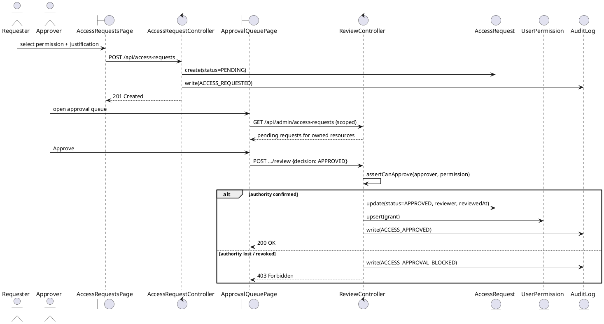

# Phase 3 — Use Case Specifications and Analysis Model

Diagram source: `use-case-diagram.puml` (paste into https://www.plantuml.com/plantuml/uml/ or any PlantUML renderer).

## Use Case Spec 1 — Login with Multi-Factor Authentication

| Field | Detail |
|---|---|
| **Use Case ID** | UC-02 |
| **Actor** | Standard User, Approver, Administrator, Auditor (any authenticated actor) |
| **Preconditions** | User has a registered, active account. User is not currently locked out. |
| **Trigger** | User submits email + password on the login screen. |

**Main Flow**
1. User enters email and password, completes the CAPTCHA challenge, and submits.
2. System verifies the CAPTCHA token with the provider.
3. System looks up the account by email and checks `isActive`.
4. System checks the account is not currently locked (`lockedUntil`).
5. System compares the submitted password against the stored bcrypt hash.
6. On match, system resets `failedLoginCount` to 0.
7. System checks whether TOTP or Passkey is enabled on the account.
8. System issues a short-lived `2fa_pending` cookie and prompts for the second factor.
9. User submits a TOTP code (or completes a Passkey challenge).
10. System verifies the second factor.
11. System computes the user's effective permissions (role-granted ∪ direct grants), issues the access + refresh JWTs, and records `LOGIN_SUCCESS` in the audit log.

**Alternative Flows**
- **A1 — No 2FA configured yet:** at step 7, if neither TOTP nor Passkey is enabled, the system forces the user into 2FA setup before any session is issued (a user can never reach an authenticated state without MFA).
- **A2 — Passkey instead of TOTP:** at step 9, the user may complete a WebAuthn ceremony instead of entering a TOTP code; flow continues identically from step 10.

**Exception Flows**
- **E1 — Invalid password (step 5):** system increments `failedLoginCount`, records `LOGIN_FAILED`, and returns a generic "Invalid credentials" error (identical wording to "account does not exist", to resist account enumeration).
- **E2 — Account locked (step 4) or lockout threshold reached (step 5, 5th consecutive failure):** system sets `lockedUntil` to now + 15 minutes, resets the failure counter, records `LOGIN_LOCKED`, and rejects the attempt regardless of password correctness for the lockout duration.
- **E3 — Invalid second factor (step 10):** system increments `totpFailedCount` (shared counter for TOTP and Passkey attempts), locks `totpLockedUntil` after 5 failures, and records `TOTP_VERIFY_FAILED` / `PASSKEY_AUTH_FAILED`.
- **E4 — Deactivated account (step 3):** rejected with the same generic "Invalid credentials" message as E1, so a deactivated account is not distinguishable from a nonexistent one.

**Postconditions**
- Success: user holds a valid access token (15 min) and refresh token (7 days); `lastLogin`/IP/geolocation fields updated; `LOGIN_SUCCESS` audited.
- Failure: no session issued; failure audited; account may transition into a locked state.

---

## Use Case Spec 2 — Approve or Reject an Access Request

| Field | Detail |
|---|---|
| **Use Case ID** | UC-05 |
| **Actor** | Approver (or Administrator) |
| **Preconditions** | Actor is authenticated. A `PENDING` AccessRequest exists. The acting user's role or direct grants include `AUDIT_LOG_READ`-equivalent for approvals — specifically an `APPROVE`/`MANAGE` permission scoped to the requested permission's resource (unless the actor is Administrator). |
| **Trigger** | Actor opens the Approval Queue and selects a pending request. |

**Main Flow**
1. Actor requests the list of pending access requests.
2. System scopes the list: Administrator sees all; any other approver sees only requests whose permission's resource they hold `APPROVE`/`MANAGE` on (computed live from `RolePermission` ∪ `UserPermission`).
3. Actor selects a request and chooses **Approve**, optionally with a review note and an expiry window.
4. System re-verifies, at the moment of the decision (not from a cached session claim), that the actor still holds approval authority over that specific resource.
5. System marks the request `APPROVED`, records the reviewer and timestamp.
6. System creates (or updates) a `UserPermission` row granting the requester that exact permission, optionally with an `expiresAt`.
7. System records `ACCESS_APPROVED` in the audit log, including the request ID, permission code, and requester ID.

**Alternative Flows**
- **A1 — Reject instead of approve:** at step 3, actor chooses **Reject** with an optional note; step 6 is skipped; system records `ACCESS_REJECTED`.
- **A2 — Administrator acting:** at step 4, an Administrator bypasses the resource-ownership check (identity administration intentionally spans all resources) but every other actor is still checked.

**Exception Flows**
- **E1 — Actor lost approval authority between listing and deciding (step 4):** e.g. their role was changed, or a time-limited grant expired, in the seconds between opening the queue and clicking Approve. System rejects the decision with 403, records `ACCESS_APPROVAL_BLOCKED`, and the request remains `PENDING` for someone who still holds authority.
- **E2 — Request already reviewed (race: two approvers act on the same request):** system rejects the second decision with 409 Conflict ("already reviewed"), since `status` is no longer `PENDING`.

**Postconditions**
- Approved: requester's effective permissions include the new grant on their *next* access-token refresh (within 15 minutes) or immediately on next login; `UserPermission` row exists; audit entry written.
- Rejected: no permission change; audit entry written; requester sees the rejection + note in their own request history.

---

## Scenario-Based Analysis Model — "Submit Access Request and Receive Approval"

This is the IAM-domain equivalent of a scenario-based analysis model: a user performs a multi-step interaction (submit → wait → get a recorded, binding outcome), directly analogous in structure to "attend an exam and submit answers" — a bounded, stateful workflow with a clear start, a decision point owned by someone else, and a durable recorded result.

### Analysis Classes (Boundary / Control / Entity)

| Class | Type | Responsibility |
|---|---|---|
| `AccessRequestsPage` | Boundary | Self-service UI: permission picker + justification form; renders the requester's own request history. |
| `ApprovalQueuePage` | Boundary | Approver-facing UI: scoped list of pending requests with Approve/Reject actions. |
| `AccessRequestController` (`/api/access-requests`) | Control | Validates input, prevents duplicate pending requests, creates the `AccessRequest` entity, triggers audit logging. |
| `ReviewController` (`/api/admin/access-requests/[id]/review`) | Control | Re-verifies approval authority live, applies the decision transactionally (status update + permission grant happen together or not at all), triggers audit logging. |
| `AccessRequest` | Entity | Persisted state: requester, permission, justification, status, reviewer, timestamps. |
| `UserPermission` | Entity | The actual grant created as a *side effect* of approval — the durable outcome of the scenario. |
| `AuditLog` | Entity | Immutable record of both the request and the decision. |

### Sequence (PlantUML — paste into plantuml.com)

This mirrors the actual implementation: `src/app/api/access-requests/route.ts` (submission) and `src/app/api/admin/access-requests/[id]/review/route.ts` (decision), with `assertCanApprove` in `src/lib/authz.ts` as the control-class authority check.
